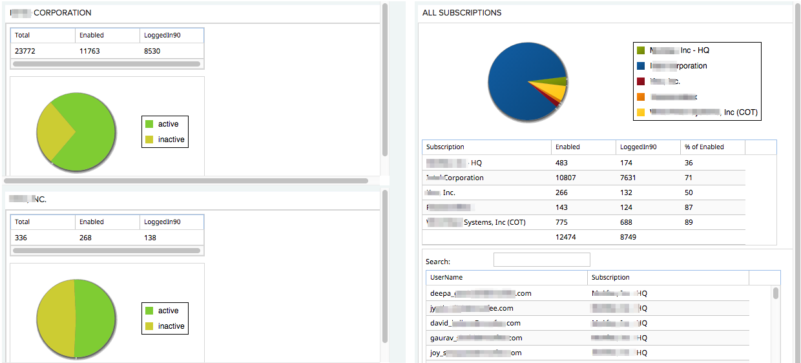

**Agile Central Cross-Subscription Dashboard App**

**Summary**

This app displays usage information from different subscriptions of **Agile Central (Rally)** so they can be viewed in one place.  This typically occurs when a large company acquires a smaller company that already has a subscription.

**Information includes:**

- Total users per subscription (this number can be raised as needed to meet demand)
- Number of enabled users per subscription
- Number of active users over the past 90 days (per subscription)
- Summary of above (Right side)
- Ability to search on a username and find the subscription where they have an account. (Right side)

The dashboard has two sides:

- **Left side** for per-subscription **Details**
- **Right Side** for **Summary** and user-search across all subscriptions

Partial screen shot:

**Installation**

**Prerequisites**

- Web server (typically behind your firewall) to install the html page for access.
- Web server needs to be enabled for https
- _For each subscription_, get an **API key** that has readonly access to the subscription.  See steps below.

As new acquisitions occur, an API key for their subs will need to be added.  See steps below.

**Installation Steps:**

- On a web server, install these files in the desired directory:
  - Dashboard.htm
  - App-uncompressed.html      (Left side, per subscription details)
  - Summary.html                      (Right side, summary and search)
- The two main files can be found on github here: [https://github.com/wrackzone/cross-subscription-users-dashboard](https://github.com/wrackzone/cross-subscription-users-dashboard)
- The Dashboard.htm file is sensitive since it holds the API keys.  We will have a secure handoff of this file.
- Modify the Dashboard.htm file with correct paths for App-uncompressed.html and summary.html on the local web server.

**Generating a New API Key:**

- An admin for the desired subscription will create the key.  Documentation on [Rally API keys is here.](https://help.rallydev.com/rally-application-manager)  Steps to create a key:

1. First sign-in to Rally for the desired subscription
2. Then go to  [https:/rally1.rallydev.com/login]rally1.rallydev.com/login
3. Click on **API KEYS** tab in the black bar at the top
4. Click **Create New API Key** and fill in form (as a Readonly key)
5. Copy and save the created key.

**Adding a New Subscription to the Dashboard**

Steps for **adding a new API key** _to support an additional subscription:_

1. Update the **dashboard.html** file on your web server.  Look for the section where the keys are listed, each key in it&#39;s own iframe statement.  A statement looks something like:

&lt;iframe src=&quot; [https://simple-wep-app-bazzert.c9users.io/](https://simple-wep-app-bazzert.c9users.io/App-uncompressed.html?apiKey=_OypWsGfdRYqT5xV6phBC3HyRvIqo) [**App-uncompressed.html**](https://simple-wep-app-bazzert.c9users.io/App-uncompressed.html?apiKey=_OypWsGfdRYqT5xV6phBC3HyRvIqo) [?apiKey=\_OypWsGfdRYqT5x](https://simple-wep-app-bazzert.c9users.io/App-uncompressed.html?apiKey=_OypWsGfdRYqT5xV6phBC3HyRvIqo)...&quot;

1. Copy and paste one of the **&quot;App-uncompressed.html?apiKey=&quot;**  iframe lines and **substitute the new API key** for the existing/copied one.
2. Below these lines is another iframe statement which has a comma separated list of API Keys.  It&#39;s different from above in that it calls the **summary.html** file.  Add the new key to the list.  The iframe statement looks something like:

&lt;iframe src=&quot;https://simple-wep-app-bazzert.c9users.io/ **summary.html**?apiKey=\_TXKnYrnQR56....

1. Save the file.  Note it may take 2 screen refreshes before the app shows your changes on both the left and right side (search and summary side) of the dashboard.

**Notes**

- For any large subscription it takes a few seconds to load the first time.  After the first time in 24-hours, the information is cached and the page loads quickly.
- After you change dashboard.html, it can take a couple refreshes to get both the left side and right side (search and summary sides) to update.
